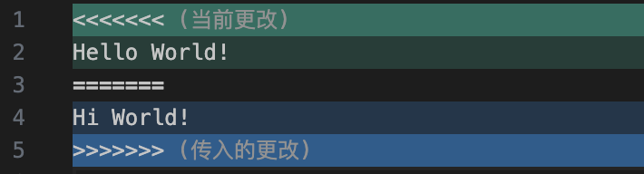
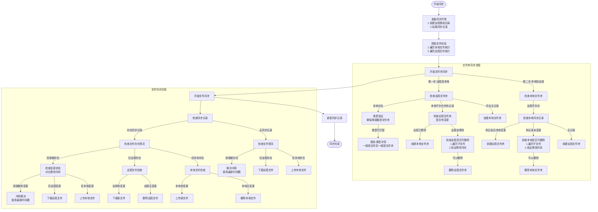

# 🔄 Obsidian Nutstore

此插件允许您通过 WebDAV 协议将 Obsidian 笔记与坚果云进行双向同步。

## ✨ 主要特性

- **双向同步算法**: 跨设备保持笔记同步
- **单点登录 (SSO)**: 无需手动输入 WebDAV 服务器地址、账号以及密钥，只需授权登录即可。
- **远程文件夹选择工具**： 通过图形界面选择远程文件夹，规避了手动输入可能存在的纰漏
- **智能冲突解决**:
  - 自动合并算法：通过字符级别的比较，自动合并发生了更改的文件，让你可以在多个客户端之间同步
  - 出现无法自动合并的情况时，会对文件内容进行标注，此时需要用户手动解决冲突

## ⚠️ 注意事项

1. 由于此插件尚不稳定，请在使用之前**备份整个 Vault**，以免同步过程中出现文件丢失、损坏、目录结构与预期不一致等问题！
2. ⏳ 首次同步可能需要较长时间 (常见于文件夹比较多的情况)
3. 发生冲突时，我们会尝试解决冲突，这个操作会同时更新本地和远程的文件，当冲突无法解决时，文件中会出现冲突标志，此时需要用户手动解决冲突。

### 如何手动解决冲突

如果你在设置里开启了 `使用Git样式的冲突标记`，遇到冲突时会在文件中插入特殊符号: `<<<<<<<`, `=======`, `>>>>>>>`，这些符号在 Obsidian 中会被意外地识别为 Markdown 语法，因此在 Obsidian 里预览的时候会很不方便，此时可以使用 VSCode 打开该文件：

其中，绿色区域就是你本地的内容，蓝色区域是云盘伤的的内容。此时，你需要手动修改这份有冲突的文件，把内容修改成理想的样子。

## 🔍 同步算法

